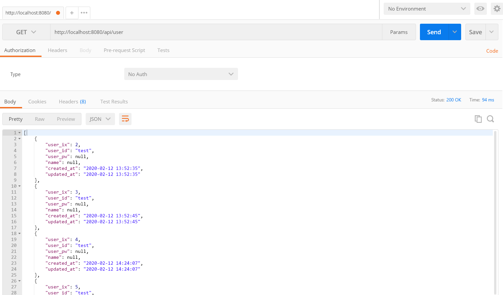

# CodeIgniter 4 RESTful API 샘플

## RESTful API 샘플은 무엇인가요?

CodeIgniter 4 웹 프레임워크를 사용하여 만든 RESTful API 샘플입니다.
KCD(Korea Community Day) 2020 행사의 일환인 "CodeIgniter4만으로 RESTful api 구현하기" 트랙을 위해 작성되었습니다.
CodeIgniter 4를 이용하여 RESTful API를 만들고자 하는분들께 시작점이 되기를 기대합니다.

## 설치 및 실행 방법

1. git clone https://github.com/hoksi/ci4rest-sample.git
2. composer install
3. copy `env-restsample` `.env`
4. php spark serve
5. http://localhost:8080/api/user 웹브라우저로 방문

## 테스트

1. User List : http://localhost:8080/api/user

2. Add User : http://localhost:8080/api/user

3. Modify User : http://localhost:8080/api/user/{user_id}

4. Get User : http://localhost:8080/api/user/{user_id}

5. Delete User : http://localhost:8080/api/user/{user_id}

## CodeIgniter는 무엇인가요?

CodeIgniter는 가볍고 빠르고 유연하며 안전한 PHP 풀 스택 웹 프레임워크입니다.

자세한 내용은 [Codeigniter 한국 사용자 포럼](https://www.cikorea.net/) 이나 [공식 사이트](http://codeigniter.com) 에서 확인할 수 있습니다.

* 사용자 가이드 안내

[한국어 버전](http://ci4doc.cikorea.net/). 
[영문 버전](https://codeigniter4.github.io/userguide/). 

